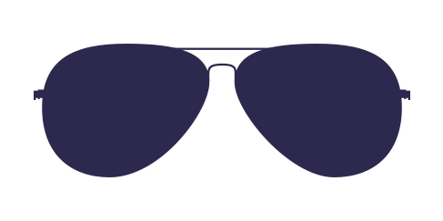

# Brand Assets: Logo vs. Tray Glyph

Reference doc for the two source-of-truth brand SVGs and how they fan out into every
rendered surface. This is a companion to
[`control-tower-visual-system.md`](control-tower-visual-system.md) (section 2.4, "the
menu-bar template glyph" and section 4, "the 12 badge tokens") — that doc specs the
tray's visual language; this doc is the asset inventory and file-path map behind it.

## 1. The two ratified rules (binding, never swapped)

Ratified by the owner, 2026-07-16. These are product invariants, not style
preferences — code already enforces rule 2 (see §4 "consumed today") and this doc
exists so no future surface silently violates either one.

1. **The Control Tower icon is THE logo.** Every brand-image surface that is *not* the
   menu-bar tray uses this asset: the macOS app icon, the download page, the welcome /
   first-run screen, email headers, and any other marketing surface. Full color,
   never tinted, never template.
2. **The aviator sunglasses icon is ALWAYS the menu-bar/tray glyph, and nothing else
   ever appears in the menu bar.** No other brand image, illustration, or SF Symbol
   fallback (beyond the documented last-resort `eyeglasses` symbol when the SVG
   genuinely cannot be read from disk) may render in the tray. Monochrome, template
   image only, tinted by the system (`.labelColor` / dark-mode auto-invert).

These two are mutually exclusive by surface, not by preference: the tray never shows
the tower, and no other surface shows the aviators. `native/models.swift` encodes this
as two separate loaders (`AviatorGlyph` vs. `ControlTowerGlyph`) specifically so the
two can never be swapped in by accident — see §4 below.

**Open item this resolves:** `docs/09-prototypes/user-experience-walkthrough.html`
still carries assumption **AS-5** ("The aviator glyph appears on the download and
marketing surface, even though in-app it's reserved for the tray... Low-stakes;
confirm brand rule.") — rule 1 above resolves AS-5: the download/marketing surface
must use the **Control Tower logo**, never the aviators. Not edited here (another
agent owns the walkthrough revisions); flagging so that pass picks it up.

## 2. Source-of-truth paths

| Asset | Canonical original (knowledge-copilot) | In-repo copy (pre-existing) | New canonical copy (this change) |
|---|---|---|---|
| Control Tower logo | *(none found — this illustration does not exist in knowledge-copilot's brand assets; it appears to have been authored directly for this repo)* | `docs/10-reference/control-tower.svg` | `assets/brand/control-tower-logo.svg` |
| Aviator glyph | `/Users/pabs/Sites/COPILOT/knowledge-copilot/01-company/01-brand/04-assets/aviators.svg` (byte-identical to the in-repo copy — verified via `diff`) | `src-tauri/icons/aviators.svg` | `assets/brand/aviator-glyph.svg` |

Both `assets/brand/*.svg` files are byte-for-byte copies of the pre-existing sources
above (not redrawn). `assets/brand/` is the new single place to look for "the brand
SVGs" without needing to know they're split across `docs/10-reference/` and
`src-tauri/icons/` for historical reasons; the older paths are left in place (code
still resolves them by their original relative paths — see §4) rather than moved, to
avoid breaking the existing loaders in the same change.

**On the logo's origin:** `knowledge-copilot`'s `01-company/01-brand/04-assets/`
directory holds the aviators glyph plus several other company/product marks
(`copilot-logo.svg`, `copilot-mark.svg`, per-app logos under `02-app-logos/`, etc.) but
no control-tower/tower illustration of any kind — confirmed by an exhaustive
`*tower*` filename search across the whole repo (only unrelated `lucide-react` icon
library matches, e.g. `tower-control.js`, under `node_modules`). The Control Tower
logo therefore has no upstream original outside this repo; `docs/10-reference/control-tower.svg`
is the asset of record. If a future refresh centralizes it in knowledge-copilot's
brand library, `assets/brand/control-tower-logo.svg` is the copy to re-sync from that
canonical source.

### What each depicts

- **`control-tower-logo.svg`** (128×128 viewBox) — a stylized airport control tower:
  a tapered tower shaft (cream `#ededf9` body, teal `#537980` cap band), an
  orange-to-yellow banded observation deck (`#fb9401` / `#f9d42f`) near the top, and a
  wide navy (`#061720`) base/ground line. Multi-color, illustrative, reads clearly at
  medium-large sizes; the existing app-icon PNGs (`src-tauri/icons/icon.png`,
  `icon.icns`, etc.) are rasterized from this same illustration.
- **`aviator-glyph.svg`** (487×243 viewBox) — a minimal single-color aviator
  sunglasses silhouette: two rounded-teardrop lens shapes, a bridge, and two small
  hinge/temple marks at the outer edges, filled solid in brand navy `#2D294E`. Because
  it's a single flat fill it works cleanly as a macOS **template image** (every
  non-transparent pixel becomes a tintable mask) — this is why it is the tray glyph
  and the tower illustration is not: at tray scale (~16–18pt) the tower's multi-color
  detail collapses into an unreadable blob (verified by rasterizing at that size; see
  `ControlTowerGlyph`'s doc comment in `native/models.swift`), while the aviators'
  single silhouette stays legible and tints correctly for light/dark menu bars.

## 3. Variant inventory needed

Per the existing build-time-rasterization decision (SVG source, PNG/ICNS variants
generated at build time — see `packaging/` and `src-tauri/icons/` for the current
Tauri-era precedent), the variants below are what each ratified asset must produce.
None of these are generated by this change; this is the checklist for the build-time
rasterization work.

### Control Tower logo (`control-tower-logo.svg` → app icon / marketing)

- [ ] macOS app icon set (`.iconset` / `.icns`), full color, all required sizes:
      16, 32, 64, 128, 256, 512, 1024 px, each at @1x and @2x (i.e. 16/32, 32/64,
      64/128, 128/256, 256/512, 512/1024 — standard Apple 10-image `.iconset` layout)
- [ ] DMG background artwork — the logo as a background-canvas element for the
      installer `.dmg` (composed with the drag-to-Applications affordance), not a
      raw icon export
- [ ] Download-page / web favicon (`favicon.ico` multi-size + `favicon.svg` for
      modern browsers)
- [ ] Download-page / web `og:image` (social-share preview card, logo composed on a
      branded background at 1200×630 or the current OG standard)
- [ ] Email header usage (fixed-height raster export, e.g. 64–128px tall, for HTML
      email — most mail clients don't render inline SVG reliably)

### Aviator glyph (`aviator-glyph.svg` → menu-bar tray only)

- [ ] Menu-bar template image: **black, alpha-only** (no color info — macOS
      recolors template images for light/dark automatically), 18pt logical size,
      exported at @1x and @2x (i.e. 18×18 and 36×36 px PNG, `NSImage` template
      naming convention `AviatorGlyph.png` / `AviatorGlyph@2x.png` if bundled as
      raster rather than loaded live from SVG). Today the app loads the SVG live at
      runtime via `AviatorGlyph.load(targetHeight:)` (`native/models.swift`) rather
      than shipping pre-rasterized PNGs — this checklist item is for a bundled-app
      packaging path if/when the app moves off live SVG loading at launch.
- [ ] Six tray badge-state overlay marks (see §5) — each a small alpha-mask PNG or
      vector composited at the glyph's bottom-trailing corner, per
      `control-tower-visual-system.md` §2.4's badge-overlay spec (~8–9pt).

## 4. Where each asset is consumed today

| Consumer | File | Asset | How |
|---|---|---|---|
| Tray glyph | `native/control-tower-tray.swift` `GlyphView` / `StatusBarController.applyBadge` | `aviator-glyph.svg` (via `AviatorGlyph.load`) | Loaded live from `src-tauri/icons/aviators.svg`, rendered as `NSImage` with `isTemplate = true`, tinted `.labelColor`. `GlyphView` explicitly draws **no** brand image in the popover header — only the badge-state SF Symbol mark or nothing (`.none`) — because the owner rejected drawing the full-color tower there (illegible at ~20pt) |
| Wizard welcome hero / roadmap sidebar | `native/wizard.swift` (via `ControlTowerGlyph.load`, defined in `native/models.swift`) | `control-tower-logo.svg` (via `ControlTowerGlyph`) | Loaded live from `docs/10-reference/control-tower.svg`, rendered full color, `isTemplate = false`, never tinted |
| App icon | `src-tauri/icons/icon.png`, `icon.icns`, `icon.ico`, and the `Square*Logo.png` Windows tile set | `control-tower-logo.svg` (pre-rasterized) | Static pre-built rasters checked into `src-tauri/icons/`, same illustration as `control-tower-logo.svg` |
| Build script | `scripts/control-tower-tray.command` | both, indirectly | Compiles `native/*.swift` (which contains the two loaders above) into the tray binary; the script itself does no asset handling — it just `cd`s to the repo root so the loaders' repo-relative paths resolve |
| Walkthrough HTML mocks | `docs/09-prototypes/user-experience-walkthrough.html` | both, as prose/annotation only | No ``/inline SVG embed of either asset today — the aviator glyph is referenced in annotation text (line ~518, ~1235) describing tray behavior and the still-open AS-5 assumption about the download page (see §1). Not edited by this change |

## 5. Tray badge-state vocabulary

The tray's base is always the aviator glyph silhouette (§1, rule 2), monochrome,
`.labelColor`-tinted. Each state composites a small, distinct mark at the
bottom-trailing corner (~8–9pt, per `control-tower-visual-system.md` §2.4/§4). Shape
is the primary encoder (must survive grayscale/color-blind/Reduce-Motion); color is
the secondary channel only. **`healthy` draws no mark at all** — silence is the
success state, consistent with the "Quiet Instrument" design intent already
established for this app.

These six states are the subset of the full 12-token `BadgeState` vocabulary
(`native/models.swift`) that maps onto this task's naming; the geometry below is the
same shape already specced in `control-tower-visual-system.md` §4, translated into
literal SVG (today the app draws these via SF Symbols — `circle`, `key.fill`,
`arrow.triangle.2.circlepath`, `exclamationmark.triangle.fill`, `cloud.slash` — this
section exists so an HTML mockup that can't use SF Symbols can still render the exact
same silhouettes).

| State | `BadgeState` token | Mark | Color |
|---|---|---|---|
| `setup-needed` | `hollow` | hollow (unfilled) circle | `#8E8E93` (secondaryLabel gray) |
| `signed-out` | `key` | key silhouette | `#0A84FF` (systemBlue) |
| `syncing` | `ring` | circular arrow / arc | glyph tint (no color, matches base) |
| `needs-attention` | `triangle` | filled triangle with `!` | `#FF9F0A` (systemOrange) |
| `offline` | `cloudSlash` | cloud with a diagonal slash | `#8E8E93` (secondaryLabel gray) |
| `healthy` | `none` | *(no mark — bare glyph)* | — |

Colors above are the standard Apple system-color hex approximations for HTML mockup
use; the native app never hardcodes these — it uses `NSColor.secondaryLabelColor` /
`.systemBlue` / `.systemOrange` so they auto-adapt to light/dark/accessibility
settings (`control-tower-visual-system.md` §2.2).

### Inline SVG for each mark (8–9pt badge, drawn in an 18×18 viewBox for mockup clarity)

**Hollow circle (`setup-needed`)** — open ring, unfilled center, 2px stroke:
```svg
<svg width="18" height="18" viewBox="0 0 18 18" xmlns="http://www.w3.org/2000/svg">
  <circle cx="9" cy="9" r="6.5" fill="none" stroke="#8E8E93" stroke-width="2"/>
</svg>
```

**Key (`signed-out`)** — round bow + shaft + two teeth, solid fill:
```svg
<svg width="18" height="18" viewBox="0 0 18 18" xmlns="http://www.w3.org/2000/svg">
  <circle cx="6" cy="6" r="3.2" fill="none" stroke="#0A84FF" stroke-width="2"/>
  <path d="M8.3 8.3 L15 15 M12 12 L14 10 M13.5 13.5 L15.5 11.5"
        stroke="#0A84FF" stroke-width="2" stroke-linecap="round" fill="none"/>
</svg>
```

**Ring / arc (`syncing`)** — two short arrows forming a circular sync motion (not a
full closed ring, so it stays visually distinct from `setup-needed`'s hollow circle):
```svg
<svg width="18" height="18" viewBox="0 0 18 18" xmlns="http://www.w3.org/2000/svg">
  <path d="M4 9 A5 5 0 0 1 13.2 5.8" fill="none" stroke="currentColor" stroke-width="2" stroke-linecap="round"/>
  <path d="M13.2 5.8 L13.6 3.2 L11 4.6 Z" fill="currentColor"/>
  <path d="M14 9 A5 5 0 0 1 4.8 12.2" fill="none" stroke="currentColor" stroke-width="2" stroke-linecap="round"/>
  <path d="M4.8 12.2 L4.4 14.8 L7 13.4 Z" fill="currentColor"/>
</svg>
```

**Triangle (`needs-attention`)** — filled triangle, exclamation mark cut out (or
overlaid in the badge's contrast color):
```svg
<svg width="18" height="18" viewBox="0 0 18 18" xmlns="http://www.w3.org/2000/svg">
  <path d="M9 2.5 L16 15 H2 Z" fill="#FF9F0A"/>
  <rect x="8.1" y="7" width="1.8" height="4.5" rx="0.9" fill="#1C1C1E"/>
  <circle cx="9" cy="13" r="1" fill="#1C1C1E"/>
</svg>
```

**Cloud with slash (`offline`)** — rounded cloud silhouette with a diagonal
line through it:
```svg
<svg width="18" height="18" viewBox="0 0 18 18" xmlns="http://www.w3.org/2000/svg">
  <path d="M5.5 12.5 a3 3 0 0 1 -0.3 -6 a4 4 0 0 1 7.6 -1.3 a3.2 3.2 0 0 1 -0.3 7.3 Z"
        fill="none" stroke="#8E8E93" stroke-width="1.6"/>
  <line x1="3" y1="3" x2="15" y2="15" stroke="#8E8E93" stroke-width="1.8" stroke-linecap="round"/>
</svg>
```

**Healthy** — no mark. The bare aviator glyph, undecorated, is the entire signal.

## 6. Referencing `assets/brand/` from mockups

If future HTML walkthrough mockups want to embed the real assets instead of
approximating them, they can reference the new canonical copies directly:

```html


```

(relative path shown from `docs/09-prototypes/`). **Not applied to the existing
walkthrough files by this change** — another agent owns those revisions; this section
is a pointer for that work, not an edit to it.
