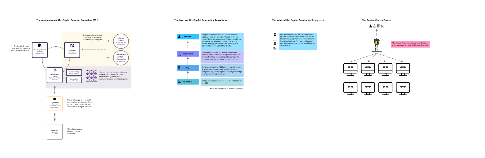
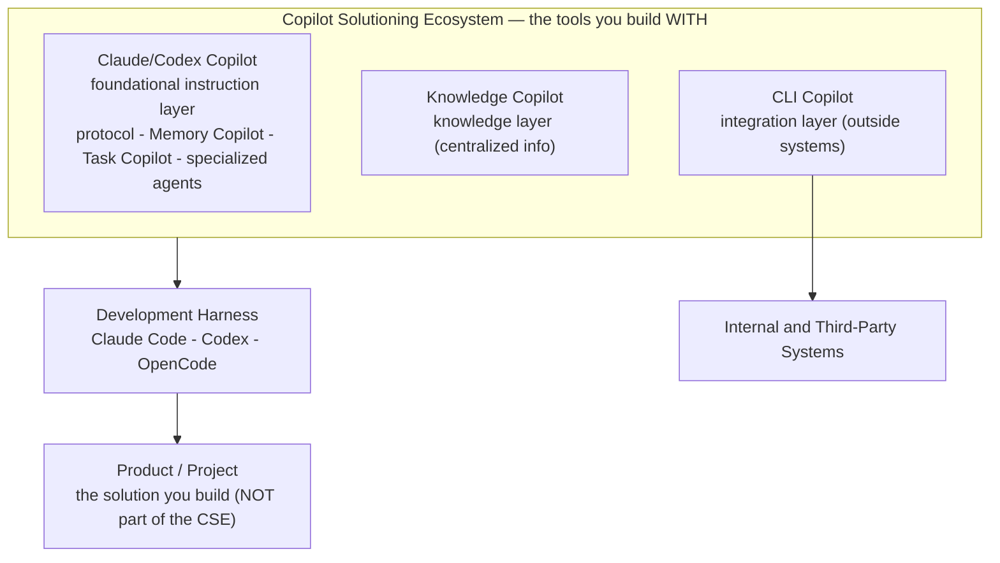
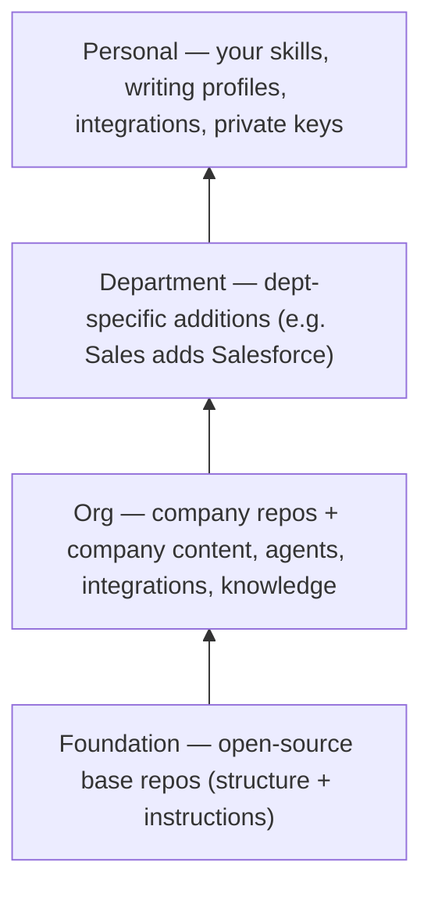
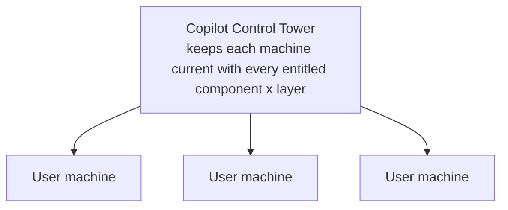

# The Copilot Solutioning Ecosystem (CSE)

Canonical reference for the system Copilot Control Tower orchestrates.

Two visual copies of the owner's diagram accompany this doc:
[`copilot-solutioning-ecosystem.svg`](./copilot-solutioning-ecosystem.svg)
(scalable; the canonical visual to use going forward) and
[`copilot-solutioning-ecosystem.png`](./copilot-solutioning-ecosystem.png)
(a raster fallback).

**For any agentic/programmatic use, use THIS document, not the images.** The SVG's
text is outlined to vector paths, so neither image is machine-readable. The
Mermaid graph and the YAML block below are the agent-readable encoding, derived
from the owner's full written description of the model (which is richer than the
diagram labels).



## The one thing to get right

The CSE is **the set of tools you build software *with***. It is **not** the
software you build. The thing you build is the **Product / Project**, and it sits
*below* the ecosystem in the stack. Control Tower orchestrates the **CSE**, never
the products.

> Example: `Insights Copilot`, `Pipeline Copilot`, and `Method` are **products**
> (outputs). They are NOT synced by Control Tower. What Control Tower syncs is the
> CSE tooling — the instruction layer, knowledge layer, and integration layer —
> that a person uses to build those products faster, more effectively, and more
> consistently.

## Components (the tools; each has a distinct role)

| Component | Layer role | What it provides |
|---|---|---|
| **Development Harness** | The terminal app you build in | Claude Code, Codex, OpenCode, etc. Manages files, accesses the web, performs all digital activity. Hosts the instruction layer. |
| **Claude / Codex Copilot** | Foundational **instruction layer** | `/protocol` (Claude) or `$protocol` (Codex); **Memory Copilot** (project memory management); **Task Copilot** (project task management); the **specialized agents**. The base standards for *how* you build. |
| **Knowledge Copilot** | **Knowledge layer** | Centralized company information (offerings, products, "who we are"). Authored/read as markdown (e.g. in Obsidian), saved to a repo. Also holds personal knowledge like writing profiles and meeting preferences. |
| **CLI Copilot** | **Integration layer** | Agentic access to systems *outside* your computer — internal systems and third-party systems (email, calendar, Slack, Salesforce, Workday, etc.). |

The **Product / Project** is the solution you build on your computer using the
above. It is the consumer of the ecosystem, not part of it.

## Layers (inheritance: Foundation to Personal)

Every component exists at **all four layers**, and each layer inherits everything
from the layers beneath it, then adds its own.

| Layer | What lives here |
|---|---|
| **Foundation** | The **open-source base repositories** of each component: the structure and instructions anyone can inherit. |
| **Org** | The **company's own repos**: org-specific agents, skills, knowledge (company content), and integrations built on top of Foundation. |
| **Department** | **Department-specific** additions (e.g. Sales adds Salesforce; Marketing adds its own CLI tools), on top of Org. |
| **Personal** | **Your own** skills, personalized writing profiles, personal integrations, and private keys, on top of Department. |

**Inheritance flows downward:** `Foundation -> Org -> Department -> Personal`.
A person at the Personal layer receives everything from Department, Org, and
Foundation, plus their own personalization.

**Entitlement is by GitHub repo access.** You get a layer (e.g. a department)
if and only if you have access to that layer's repo. Selecting a department you
are entitled to causes Control Tower to sync it onto your machine.

## The value

Each person who uses the CSE inherits the updates from their Department, Org, and
Foundation, giving them the tools to perform their job effectively. Their Personal
updates give them personalization that amplifies them as an individual.

## Control Tower's role

**Keep every user's machine current with the latest version of every CSE
component at every layer they are entitled to** — and make personalizing at your
own level effortless. Concretely:

1. **Sync/inherit** the CSE component repos down the four tiers (pull-only,
   downward).
2. **Entitlement by repo access** — surface the departments a user can join and,
   on selection (if they have the repo), sync that layer onto their machine.
3. **Centralized secrets for shared integrations** — org/department integration
   keys (Workday, Microsoft, Salesforce, etc.) stored once and provisioned by
   entitlement, so users never set up their own API keys.
4. **Personal customization + personal keys** — sync a user's personal layer to
   their repo, and (goal) sync their personal private keys across their own
   machines so they stop hand-copying `.env` files.

## Mermaid encodings (agent-readable)

### Components



### Layers and inheritance



Note: each layer carries all components (Claude/Codex Copilot + Knowledge Copilot
+ CLI Copilot). Arrows show inheritance direction (each layer inherits from those
beneath it).

### Control Tower



## Machine-readable model

```yaml
cse:
  definition: "The tools used to build software; NOT the software being built."
  components:
    - id: development_harness
      role: "terminal app you build in; hosts the instruction layer"
      examples: [Claude Code, Codex, OpenCode]
    - id: claude_codex_copilot
      role: "foundational instruction layer"
      provides: [protocol_command, memory_copilot, task_copilot, specialized_agents]
    - id: knowledge_copilot
      role: "knowledge layer (centralized company + personal knowledge)"
      authored_as: markdown
    - id: cli_copilot
      role: "integration layer (access to systems outside the computer)"
      connects: [internal_systems, third_party_systems]
  layers:            # inheritance flows top-down in this list
    - id: foundation
      contents: "open-source base repos: structure + instructions to inherit"
    - id: org
      contents: "company repos: org agents, skills, knowledge, integrations"
    - id: department
      contents: "department-specific additions (e.g. sales -> salesforce)"
    - id: personal
      contents: "personal skills, writing profiles, integrations, private keys"
  rules:
    - "every layer contains all components"
    - "each layer inherits everything from the layers beneath it"
    - "entitlement to a layer == access to that layer's GitHub repo"
  not_managed_by_control_tower:
    - product_project   # the solution built WITH the CSE (e.g. Insights Copilot, Pipeline, Method)
control_tower:
  role: "keep each user's machine current with every CSE component at every entitled layer"
  responsibilities:
    - inherit_sync: "pull-only, downward, across the four tiers"
    - entitlement: "by GitHub repo access; surface + join entitled departments"
    - shared_secrets: "central org/dept integration keys, provisioned by entitlement"
    - personal: "sync personal layer; goal: sync personal private keys across a user's own machines"
```

## Open design questions

> **Status:** these are resolved in
> [`cse-alignment-decisions.md`](./cse-alignment-decisions.md). In short: MDM is
> dropped and GitHub repo access is the entitlement spine; Q1 = separate
> co-resolved repos (not fork/upstream); Q3 = tier-scoped shared secret store,
> endpoint via inherited org config. Q2 (department discovery/join) and Q4
> (personal-key multi-machine sync) are accepted and move to design.

1. **Inheritance mechanism** — how does an Org "take" the Foundation version:
   clone, fork, or template + upstream remote? (Determines how Orgs pull future
   Foundation updates while keeping their own additions.)
2. **Department discovery + join flow** — surface the departments a user is
   entitled to, validate by repo access, sync on selection.
3. **Central secret store** for shared org/department integration keys (endpoint
   + access model, provisioned by entitlement, never in git).
4. **Personal-key sync across a user's own machines** — remove the multi-machine
   `.env` hand-copying pain.
